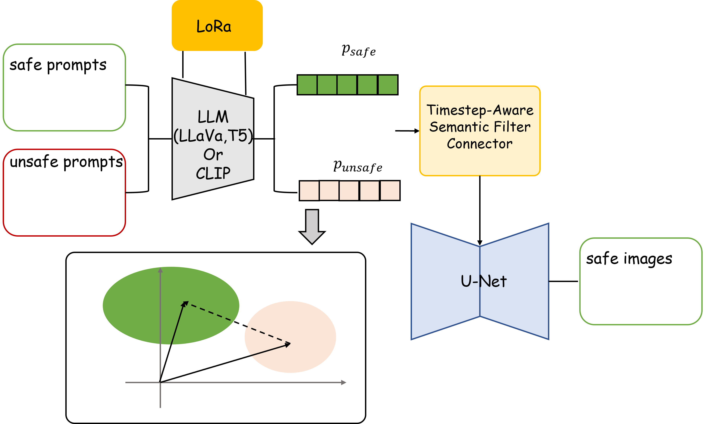

This is the official repository of *SafetyLLM*.

<div align="center">

<h1>SafetyLLM: Safety Alignment for Text-to-Image Generation in LLM</h1>


Mengqi Huang<sup>1</sup>, Shuhan Zhuang<sup>1</sup>

<sup>1</sup>University of Science and Technology of China

</div>

<p align="center">

</p>

**Safety alignment for T2I.** Integrating LLMs at the text encoder stage has emerged as a growing trend in the field of image generation. Following this natural progression, we propose to perform safety alignment directly within the LLM, thereby enabling a unified approach to safety across both LLMs and image/video generation systems. To validate that safety alignment at the LLM level can still exert substantial influence on downstream image generation tasks, we conduct experimental studies on ELLA. Specifically, we adopt the core principles of DPO to achieve safety alignment for text-to-image (T2I) models.


## 💾Dataset
We use [CoProV2](https://hkustconnect-my.sharepoint.com/:u:/g/personal/rliuay_connect_ust_hk/Ea45o2IzRLZMi26CnbNQyZ8BEMQnBAwGs0TBijBjUm1hqg?e=qTGdGz) for model training. Please download the dataset from the link and unzip it in the `datasets` folder. The category of each prompt is included in `data/CoProv2_train.csv`.

## Environment
To set up the conda environment, run the following command:
```bash
conda env create -f environment.yaml
```
After installation, activate the environment with:
```bash
conda activate SafetyLLM
```

## Inference

To run the inference, execute the following command:

```bash
python inference.py --model_path MODEL_PATH --prompts_path PROMPT_FILE --save_path SAVE_PATH
```

- `--model_path`: Specifies the path to the trained model. 
- `--prompts_path`: Specifies the path to the csv prompt file for image generation, please make sure the csv file contains the following columns: `prompt`, `image`.
- `--save_path` : Specifies the folder path to save the generated images.

 
